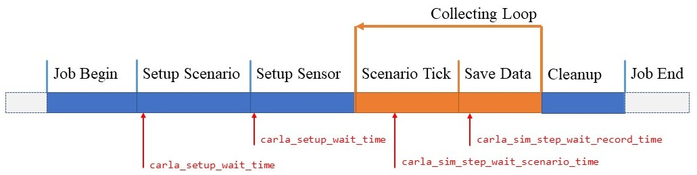

# CARLA Sensor Configuration Dataset Generator

**VERSION: 0.2.0**

The CARLA Sensor Configuration Dataset Generator is an open-source program that allows you to generate a [CARLA Simulator](https://github.com/carla-simulator/carla) dataset that is based on a sensor configuration file specified by the user. 

## Processes and Trials

The application takes a set of sensor configuration inputs from a file in YAML format, decodes them into a job sequence, runs a test and finally generates a dataset that matches the sensor configuration description. According to the design of the program, once the sensors and scenarios are configured, the program can fully automate the generation of the corresponding datasets.

In the program, each test is a slice of the road test scenario. The road test scenario is based on equal sampling (with user defined randomness) of the number of targets collected and slices based on this. Once the sensor is set up, the program will traverse all the slice points in a direct set (no replay process) and collect data from each slice point. Finally, the program will run all scenarios for each sensor configuration and generate a set of data sets.


## Requirments

- Python 3.8.X Environment
- Special version of the self-built CARLA Simulator (Includes customised maps and assets)
  - Windows: [OneDrive](https://1drv.ms/u/s!AlsjJokLSSi8gekoeku4vFsb4ZAYew?e=J0gQIM) / [Baidu Netdisk](https://pan.baidu.com/s/1gunABaw2A10OQiTd1C9uig?pwd=kk93)
  - Linux: [OneDrive](https://1drv.ms/u/s!AlsjJokLSSi8gekniz4iciEvE22a0g?e=p7DDtY) / [Baidu Netdisk](https://pan.baidu.com/s/1YrpKcAGLfnTv4o7DrSS9qQ?pwd=w625)

## Install

1. Decompression self-built CARLA Simulator to `{CARLA_ROOT}`
   
   > `{CARLA_ROOT}` is the root directory of **CARLA Simulator**. You can define this directory yourself. In the following, please replace the keyword with the appropriate directory.

2. Clone or Decompression this program to `{APP_ROOT}`

    > `{APP_ROOT}` is the root directory of **this application**. You can define this directory yourself. In the following, please replace the keyword with the appropriate directory.

3. **(OPTIONAL)** Create and activate virutal Python environment
   
    ```
    # Create virtual environment
    $ cd {APP_ROOT}
    $ python -m venv ./venv

    # [Windows+Powershell] Activate venv
    $ .\venv\Scripts\Activate.ps1

    # [Windwos+CMD] Activate venv
    $ .\venv\Scripts\activate.bat

    # [Linux] Activate venv
    $ source ./venv/bin/activate

    ```

4. Install requirements Python packages
   
    ```
    # Install public packages
    $ pip install -r ./requirements.txt

    # [Windows] Install carla python packages
    $ pip install {CARLA_ROOT}\PythonAPI\carla\dist\carla-0.9.13-cp38-cp38-win_amd64.whl

    # [Linux] Install carla python packages
    $ pip install {CARLA_ROOT}/PythonAPI/carla/dist/carla-0.9.13-cp38-p38-liunux_x86_64_whl
    ```

    > **⚠ WARN:** You must use the `.whl` package included in the CARLA distribution we provide, otherwise an unknown error may be raised!

## Quick Start

This program contains a simple demo that consists of a set of sensor configuration files (File: `./input/demo_config_*.yaml`), a set of road test scenario replay file (File: `./scenarios/demo*.log`) and their profiles (File: `./scenario.yaml`). This means that you can run the program directly and try to [set up sensors](#setup-sensors) and [set up sceanrios](#setup-scenarios) later.

1. Start CARLA Simulator and keep it on at all times.

    ```
    $ cd {CARLA_ROOT}

    # [Windows]
    # You can also open it directly by double-clicking on it using the Windows GUI.
    $ .\CarlaUE4.exe

    # [Linux]
    $ ./CarlaUE4.sh
    ```

    > **⚠ WARN:** The program will automatically reset and set up CARLA world, please do not run other CARLA clients during the whole process.

2. Start demo:
   
    ```
    $ python ./main.py -c 20
    ```

If everything is all right, you will not see any log of the ERROR level in the system standard output. And in the output folder (`{./output/}`), you will see the following file structure.

```
output
 ├─demo_config_1  # Result from config file demo (demo_config_1.yaml)
 │  ├─demo_scenario_1
 │  │   ├─0           # The first sensor in the list of yaml files 
 │  │   │  ├─123.png  # camera -> png result
 │  │   │  ├─...
 │  │   │  └─143.png  # the number of result: 20
 │  │   ├─1
 │  │   │  ├─123.ply  # lidar -> ply result
 │  │   │  ├─...
 │  │   │  └─143.ply    
 │  │   └─2
 │  │      ├─123.csv  # radar -> csv result
 │  │      ├─...
 │  │      └─143.csv  
 │  └─demo_scenario_2
 └─demo_config_2 

```


## Setup Sensors

Please move to [setup sensors page](./docs/setup_sensors.md) for detailed information


## Setup Scenarios

Please move to [setup scenarios page](./docs/setup_scenarios.md) for detailed information


## Arguments

Program can control behaviour by adding startup arguments, You can refer to the [application arguments page](./docs/application_arguments.md) to learn all the arguments of the program.

If you just need a simple reference, please try the following code to access the arguments help screen:

```
$ python ./main.py -h
```

## Adjustments

Due to the different configurations of the hardware devices running the CARLA simulator, in some cases it may be necessary to adjust the startup arguments of this program to ensure correct and efficient data acquisition.

The workflow of the program is as shown below, **with the values you need to adjust marked in red**:



Please refer to the [application arguments page](./docs/application_arguments.md) for more details on how to adjust

## About

### License

The CARLA Sensor Configuration Iterator spcific code is distributed under MIT License.

### Authors

The CARLA Sensor Configuration Iterator specific code is the work of **ZHAO Zirui** during his employment at the Southern University of Science and Technology. He will provide limited open source maintenance for the duration of his employment.
